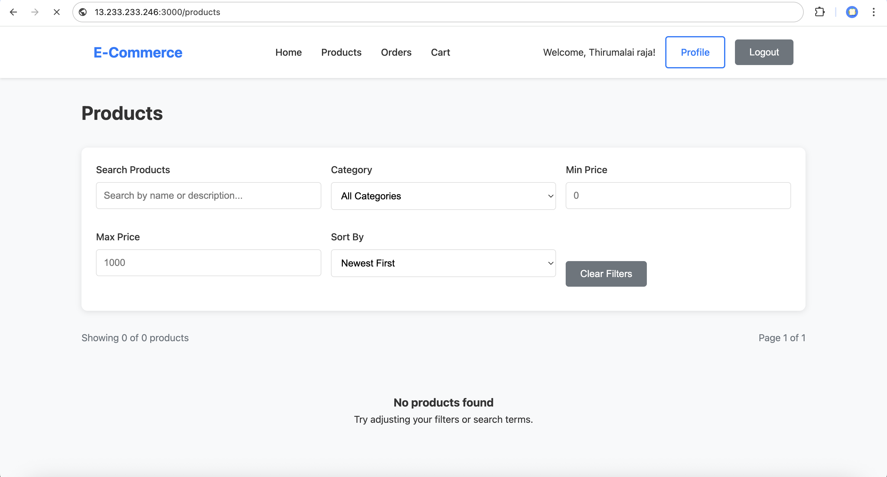

# 🛒 E-commerce Microservices Deployment on AWS EC2 with Terraform and Docker

This project provisions an EC2 instance using Terraform and automatically deploys a full e-commerce microservices stack via Docker.

---

## 🐳 Docker Images & Services

This project uses Docker to deploy a complete microservices-based e-commerce application on an EC2 instance. Each service runs as a separate container and communicates via internal EC2 IP.


| Service         | Port | Docker Image                          | Description                               |
|-----------------|------|----------------------------------------|-------------------------------------------|
| User Service    | 3001 | `thirumalaipy/ecom-users:1.0`         | Handles user authentication and profiles. |
| Product Service | 3002 | `thirumalaipy/ecom-products:1.0`      | Manages product listing and metadata.     |
| Cart Service    | 3003 | `thirumalaipy/ecom-cart:1.0`          | Manages shopping cart operations.         |
| Order Service   | 3004 | `thirumalaipy/ecom-order:1.0`         | Handles order creation and tracking.      |
| Frontend App    | 3000 | `thirumalaipy/ecom-frontend:1.0`      | React-based frontend for the e-commerce UI. |


## Environment Variables 
```
# User Service
PORT=3001
MONGODB_URI=mongodb+srv://<username>:<password>@cluster.mongodb.net/dbname
JWT_SECRET=your_jwt_secret

# Product Service
PORT=3002
MONGODB_URI=mongodb+srv://<username>:<password>@cluster.mongodb.net/dbname

# Cart Service
PORT=3003
MONGODB_URI=mongodb+srv://<username>:<password>@cluster.mongodb.net/dbname
PRODUCT_SERVICE_URL=http://<EC2_IP>:3002

# Order Service
PORT=3004
MONGODB_URI=mongodb+srv://<username>:<password>@cluster.mongodb.net/dbname
CART_SERVICE_URL=http://<EC2_IP>:3003
PRODUCT_SERVICE_URL=http://<EC2_IP>:3002
USER_SERVICE_URL=http://<EC2_IP>:3001

# Frontend App
REACT_APP_USER_SERVICE_URL=http://<EC2_IP>:3001
REACT_APP_PRODUCT_SERVICE_URL=http://<EC2_IP>:3002
REACT_APP_CART_SERVICE_URL=http://<EC2_IP>:3003
REACT_APP_ORDER_SERVICE_URL=http://<EC2_IP>:3004
```

---

## 📁 Terraform Structure - /terraform folder

```
├── main.tf
├── variables.tf
├── outputs.tf
├── providers.tf
├── environments/
│   └── dev/
│       ├── dev_backend.tfvars     # S3 backend configuration for dev
│       ├── dev.tfvars             # Variable values for dev environment
├── modules/
│   └── ec2/
│       ├── main.tf                # EC2 provisioning logic
│       └── ...                    # Other module files
├── scripts/
│   └── deploy.sh.tpl              # Template shell script for remote EC2 deployment
```

## ⚙️ Prerequisites

- Terraform ≥ 1.0
- AWS CLI configured (`aws configure`)
- Docker (for image builds or tests)
- AWS Key Pair for EC2 access
- Public Docker images built and pushed

**Build Multi-Architecture Docker Images (Recommended for Public Images)**

To ensure your Docker images are compatible with both `amd64` and `arm64` EC2 instance types, you should build them with multi-architecture support.

Use Docker Buildx to build and push your image for multiple platforms:

```
docker buildx create --use
docker buildx build --platform linux/amd64,linux/arm64 -t thirumalaipy/ecom-users:1.0 --push .
```

---

## 🌱 Terraform Setup

### 1. Backend Configuration - Storing the tfstate on the S3 bucket

```
bucket = "thiru-tfstate-bucket"
key = "dev-mern/terraform.tfstate"
region="ap-south-1"
use_lockfile = true
```

### 2. Terraform Variables

Create a `terraform.tfvars` file with all necessary inputs:

```
ami_id            = "ami-xxxxxxxx"
instance_type     = "t2.micro"
key_name          = "your-key-name"
private_key_path  = "~/.ssh/your-key.pem"
ec2_subnet_id     = "subnet-xxxxxxxx"
volume_size       = 10
volume_type       = "gp2"
security_groups   = ["sg-xxxxxxxx"]
tag_name          = "ecom-server-dev"
env_name          = "dev"
mongodb_uri       = "your-mongodb-uri"
jwt_secret        = "your-jwt-secret"
```

### 3. Terraform Commands

**a. Initialize Terraform**

`terraform init -backend-config="backend-dev.tf"`

**b. Format and Validate**

`terraform fmt`
`terraform validate`

**C. Terraform Plan**

`terraform plan -var-file="environments/dev/dev.tfvars"`

**d. Terraform Apply**

`terraform apply -var-file="environments/dev/dev.tfvars"`


**e. (Optional) Terraform Destroy**

`terraform destroy -var-file="environments/dev/dev.tfvars" -auto-approve`

---

## ✅ Outputs

### Front Website ouput

**Home Page**


**Cart Page**


**Profile Page**


**Product Page**



### Terraform outputs

**S3 Bucket State File Saved**


**Connection to host Remote via Exec**


**Pull and run User Image - Remote Exec**


**Pull and run Product Image - Remote Exec**


**Pull and run Cart Image - Remote Exec**


**Pull and run Order Image - Remote Exec**


**Pull and run Frontend Image - Remote Exec**


### EC2 Docker Status Output

All the images are successfully pulled and working

